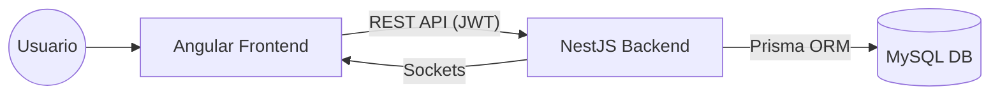
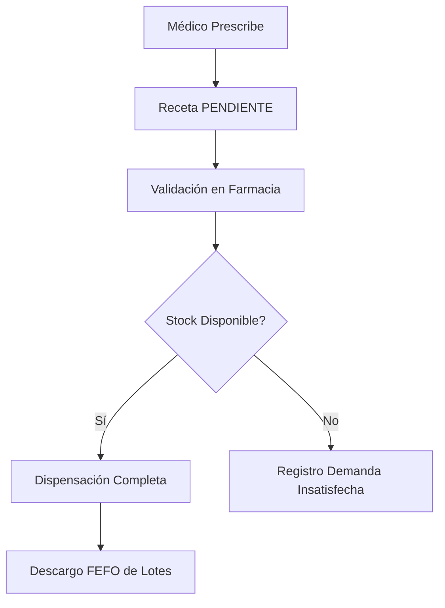

# Documentación Técnica Integral - Sistema Integral de Servicios de Salud (SISS)

Este documento centraliza toda la información técnica necesaria para comprender, desarrollar y mantener el sistema SISS.

## 1. Arquitectura General del Sistema

El SISS sigue una arquitectura de tres capas moderna:
*   **Presentación (Frontend)**: SPA construida con Angular 19, optimizada para la captura rápida de datos clínicos.
*   **Lógica de Negocio (Backend)**: API REST modular construida con NestJS (Node.js/TypeScript).
*   **Persistencia (Base de Datos)**: MySQL gestionada a través de Prisma ORM.

### Diagrama de Comunicación


---

## 2. Referencia del Backend (API)

El backend es el motor del sistema, gestionando la seguridad, la integridad de los datos y las integraciones externas (RNP, CIE-10).

### Documentación Interactiva (Swagger)
Se ha implementado **Swagger** para documentar todos los endpoints disponibles.
*   **URL Local**: `http://localhost:3000/api-docs` (Cuando el servidor está corriendo).
*   **Características**: Permite probar los endpoints directamente desde el navegador, detallando los DTOs y esquemas de respuesta.

### Estructura del Código
El proyecto sigue la estructura estándar de NestJS:
*   `src/modules/`: Contiene los módulos funcionales (Pacientes, Citas, Farmacia, etc.).
*   `src/common/`: Guards, Interceptors, Decorators y filtros compartidos.
*   `src/prisma/`: Configuración del cliente Prisma y semillas de datos.

### Diccionario de Datos
Para una referencia detallada de las tablas y campos de la base de datos, consulte:
[DICCIONARIO_DATOS.md](file:///c:/Proy/claude/siss/siss-backend/DICCIONARIO_DATOS.md)

---

## 3. Referencia del Frontend (Angular)

El frontend está diseñado para ofrecer una experiencia de usuario fluida en entornos de alta presión como salas de emergencia y triaje.

### Reporte de Arquitectura (Compodoc)
Se ha generado un reporte técnico completo utilizando **Compodoc**.
*   **Ubicación**: `siss-frontend/docs/index.html`
*   **Contenido**: Diagramas de módulos, árbol de rutas, documentación de componentes y servicios.

### Sistema de Diseño
*   **TailwindCSS**: Utilizado para un diseño responsivo y moderno.
*   **Chart.js**: Para visualizaciones en el tablero de control y epidemiología.
*   **Leaflet**: Integración de mapas para geolocalización epidemiológica.

---

## 4. Seguridad y Autenticación

El sistema implementa un modelo de seguridad robusto:
1.  **Autenticación**: Basada en **JWT (JSON Web Tokens)** con Refresh Tokens para persistencia de sesión.
2.  **Autorización (RBAC)**: Control de acceso basado en roles y permisos granulares por establecimiento y servicio.
3.  **Auditoría**: Cada acción crítica es registrada en la tabla `AuditLog`, vinculando al usuario, la acción y los datos afectados.

---

## 5. Guía de Configuración Local

### Requisitos Previos
*   Node.js v20+
*   MySQL 8.0+

### Pasos de Instalación
1.  **Backend**:
    ```bash
    cd siss-backend
    npm install
    # Configurar .env con DATABASE_URL
    npx prisma migrate dev
    npm run start:dev
    ```
2.  **Frontend**:
    ```bash
    cd siss-frontend
    npm install
    npm start
    ```

---

## 6. Módulos Críticos y Flujos

### Flujo de Dispensación de Medicamentos


---
*Documentación generada automáticamente el 29 de abril de 2026.*
