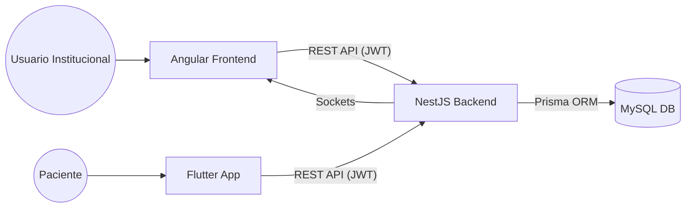

# Documentación Técnica Integral - Sistema Integral de Servicios de Salud (SISS)

Este documento centraliza toda la información técnica necesaria para comprender, desarrollar y mantener el sistema SISS.

## 1. Arquitectura General del Sistema

El SISS sigue una arquitectura de tres capas moderna:
*   **Presentación (Frontend)**: SPA construida con Angular 19, optimizada para la captura rápida de datos clínicos.
*   **Lógica de Negocio (Backend)**: API REST modular construida con NestJS (Node.js/TypeScript).
*   **Persistencia (Base de Datos)**: MySQL gestionada a través de Prisma ORM.

### Diagrama de Comunicación


---

## 2. Referencia del Backend (API)

El backend es el motor del sistema, gestionando la seguridad, la integridad de los datos y las integraciones externas (RNP, CIE-10).

### Documentación Interactiva (Swagger)
Se ha implementado **Swagger** para documentar todos los endpoints disponibles.
*   **URL Local**: `http://localhost:3000/api-docs` (Cuando el servidor está corriendo).
*   **Características**: Permite probar los endpoints directamente desde el navegador, detallando los DTOs y esquemas de respuesta.

### Estructura del Código
El proyecto sigue la estructura estándar de NestJS:
*   `src/modules/`: Contiene los módulos funcionales (Pacientes, Citas, Farmacia, etc.).
*   `src/common/`: Guards, Interceptors, Decorators y filtros compartidos.
*   `src/prisma/`: Configuración del cliente Prisma y semillas de datos.

### Diccionario de Datos
Para una referencia detallada de las tablas y campos de la base de datos, consulte:
[DICCIONARIO_DATOS.md](file:///c:/Proy/claude/siss/siss-backend/DICCIONARIO_DATOS.md)

---

## 3. Referencia del Frontend (Angular)

El frontend está diseñado para ofrecer una experiencia de usuario fluida en entornos de alta presión como salas de emergencia y triaje.

### Reporte de Arquitectura (Compodoc)
Se ha generado un reporte técnico completo utilizando **Compodoc**.
*   **Ubicación**: `siss-frontend/docs/index.html`
*   **Contenido**: Diagramas de módulos, árbol de rutas, documentación de componentes y servicios.

### Sistema de Diseño
*   **TailwindCSS**: Utilizado para un diseño responsivo y moderno.
*   **Chart.js**: Para visualizaciones en el tablero de control y epidemiología.
*   **Leaflet**: Integración de mapas para geolocalización epidemiológica.

---

## 4. Seguridad y Autenticación

El sistema implementa un modelo de seguridad robusto:
1.  **Autenticación**: Basada en **JWT (JSON Web Tokens)** con Refresh Tokens. Sistema dual de autenticación para Usuarios Institucionales y Pacientes (Tablas Aisladas).
2.  **Autorización (RBAC)**: Control de acceso basado en roles y permisos granulares por establecimiento y servicio.
3.  **Aislamiento de Datos**: Separación estricta entre perfiles administrativos y perfiles ciudadanos para proteger la privacidad del paciente.
4.  **Auditoría**: Cada acción crítica es registrada en la tabla `AuditLog`, vinculando al usuario, la acción y los datos afectados.

---

## 5. Guía de Configuración Local

### Requisitos Previos
*   Node.js v20+
*   MySQL 8.0+

### Pasos de Instalación
1.  **Backend**:
    ```bash
    cd siss-backend
    npm install
    # Configurar .env con DATABASE_URL
    npx prisma migrate dev
    npm run start:dev
    ```
2.  **Frontend**:
    ```bash
    cd siss-frontend
    npm install
    npm start
    ```

---

## 6. Módulos Críticos y Lógica de Alta Complejidad

### A. Gestión de Dispensación (Farmacia)
Este módulo implementa lógica crítica para el control de suministros médicos:
*   **Algoritmo FEFO (First Expired, First Out)**: Al dispensar, el sistema selecciona automáticamente los lotes más próximos a vencer, garantizando la rotación eficiente del inventario.
*   **Validación de Traslape de Tratamiento**: El sistema calcula si un paciente ya tiene un tratamiento activo del mismo medicamento basándose en la dosis y frecuencia, previniendo duplicidades peligrosas o desperdicio.
*   **Descargo Transaccional**: La operación de inventario es atómica; si falla el registro de la entrega, no se descuenta el stock, asegurando consistencia absoluta.

### B. Encuentro Médico Orquestado (Historia Clínica)
El registro de una consulta es la operación con mayor número de interacciones en el sistema:
*   **Orquestación de Entidades**: En una sola transacción, el sistema crea la nota clínica (SOAP), diagnósticos CIE-10, recetas, solicitudes de laboratorio, incapacidades y referencias.
*   **Vigilancia Epidemiológica**: El sistema detecta diagnósticos de notificación obligatoria y genera automáticamente fichas epidemiológicas vinculadas a la semana epidemiológica calculada.
*   **Automatización de Citas**: Cierra el encuentro actual y puede programar el seguimiento (próxima cita) vinculándolo directamente a la historia del paciente.

### C. Gestión de Agendas y Disponibilidad
Módulo encargado de la coordinación de recursos humanos y espacios físicos:
*   **Motor de Disponibilidad**: Calcula en tiempo real si un médico está disponible para una cita cruzando su "Agenda Base" (horarios recurrentes) con la tabla de "Excepciones" (licencias, vacaciones, feriados).
*   **Validación de Cruce de Establecimientos**: El sistema impide programar citas en horarios donde el médico ya tiene asignada una jornada en otro establecimiento del sistema integral.
*   **Persistencia Temporal**: Utiliza comparaciones de cadenas para horas (`HH:mm`) y fechas UTC para garantizar que las zonas horarias no afecten la programación de citas.

### D. Personalización y Gestión de Medios (Carrusel)
El sistema permite la administración dinámica de la interfaz de bienvenida:
*   **Gestión de Activos**: Los administradores pueden subir, activar y desactivar imágenes y avisos institucionales desde el módulo de configuración.
*   **Visibilidad Segmentada**: Los medios pueden configurarse para aparecer en diferentes momentos del ciclo de vida de la sesión del usuario.

---

*Documentación actualizada el 7 de mayo de 2026.*
