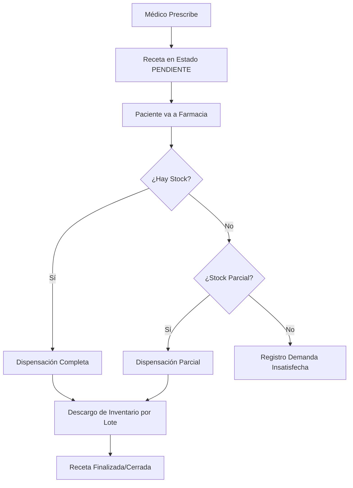

# Documentación Técnica: Sistema Integral de Servicios de Salud (SISS)

## 1. Introducción
El **SISS** es una plataforma integral de gestión hospitalaria y salud pública diseñada para estandarizar la atención médica, el control de inventarios de biológicos (PAI) y la vigilancia epidemiológica. El sistema destaca por su arquitectura **multi-establecimiento**, permitiendo que el personal rote entre centros de salud manteniendo un control granular de permisos y auditoría.

## 2. Architecura Tecnológica
*   **Frontend**: Angular con una interfaz de alta densidad de información, optimizada para entornos clínicos.
*   **Backend**: NestJS (Node.js) con arquitectura modular.
*   **Base de Datos**: MySQL gestionado a través de **Prisma ORM**, con una estructura altamente documentada y normalizada.
*   **Reportes**: Motor de generación de PDF integrado para recetas, carnets de vacunación y referencias.
*   **Estandarización**: Uso estricto de la zona horaria de Honduras (UTC-6) y catálogos internacionales como **CIE-10**.

---

## 3. Módulos Principales

### A. Gestión de Agendas y Citas
El módulo de agendas es el motor operativo del sistema, permitiendo una planificación precisa de los recursos humanos.
*   **Agenda Base**: Define la jornada laboral y duración estimada por cita (slots) por médico y establecimiento.
*   **Excepciones**: Gestión de ausencias (Vacaciones, Incapacidades, Congresos).
*   **Flujo de la Cita**: Programada -> En Sala -> Triaje -> Atendida.

### B. Historia Clínica Digital (EMR)
*   **Metodología SOAP**: Estructuración de notas médicas (Subjetivo, Objetivo, Análisis, Plan).
*   **Diagnósticos CIE-10**: Buscador integrado con codificación internacional.
*   **Prescripción Integrada**: Generación automática de recetas, órdenes de laboratorio y radiología desde el encuentro médico.

### C. Farmacia: Inventario, Prescripción y Dispensación (Detalle)
Este módulo garantiza el uso racional de medicamentos y el control estricto de los insumos estatales.

#### 1. Catálogo Maestro y Control de Inventario
*   **Medicamentos**: Clasificados por Denominación Común Internacional (DCI), vía de administración y grupo terapéutico.
*   **Gestión por Lotes**: El inventario se controla de forma granular por número de lote y fecha de vencimiento para garantizar la seguridad del paciente.
*   **Alertas de Stock**: Notificaciones visuales cuando las existencias caen por debajo del nivel mínimo configurado.
*   **Movimientos**: Registro trazable de Entradas, Salidas, Ajustes, Bajas por caducidad y Pérdidas.

#### 2. Flujo de Prescripción (Médico)
*   **Detalle Técnico**: Cada medicamento prescrito incluye dosis, frecuencia (ej: cada 8 horas), duración del tratamiento y cantidad total.
*   **Medicamentos Controlados**: Identificación de sustancias psicotrópicas que requieren flujos de validación especiales.
*   **Estados de la Receta**: PENDIENTE (Emitida), PARCIAL (Entregada parcialmente), DISPENSADA (Completada), CANCELADA o DEMANDA_INSATISFECHA.

#### 3. Flujo de Dispensación (Farmacia)
*   **Validación**: El farmacéutico visualiza las recetas pendientes vinculadas al expediente del paciente.
*   **Descargo de Stock**: Al dispensar, el sistema descuenta automáticamente las unidades del lote más próximo a vencer (First Expired, First Out - FEFO).
*   **Entregas Parciales**: Si no hay stock completo, el sistema permite entregar una parte y mantiene el resto como pendiente.
*   **Demanda Insatisfecha**: Registro crítico de medicamentos solicitados que no pudieron ser entregados por falta de stock, sirviendo como insumo para la planificación de compras.

### D. Programa Ampliado de Inmunizaciones (PAI)
Este módulo gestiona el esquema nacional de vacunación y el inventario crítico de biológicos.
*   **Inmunización Segura**: Control estricto de dosis aplicadas según la edad del paciente y el esquema nacional vigente.
*   **Gestión de Biológicos**: Control de lotes físicos, fabricantes y fechas de vencimiento de las vacunas.
*   **Cadena de Frío**: Registro de movimientos que permite rastrear la integridad térmica de los biológicos (pérdidas por cadena de frío).
*   **Carnet Digital**: Historial completo de inmunizaciones accesible desde el expediente único, con generación de carnets institucionales.

### E. Vigilancia Epidemiológica y Alertas
Integra la detección clínica con la respuesta de salud pública de manera automática.
*   **Disparo por Diagnóstico**: Alerta inmediata al médico cuando se selecciona un código CIE-10 de notificación obligatoria (ej: Dengue, Malaria, ZIKA).
*   **Ficha Epidemiológica**: Formulario obligatorio que captura el inicio de síntomas, antecedentes de viaje y contactos de riesgo.
*   **Geolocalización (GIS)**: Captura de coordenadas exactas (Latitud/Longitud) del domicilio para el mapeo de brotes y mapas de calor.
*   **Gestión de Investigación**: Flujo de estados para el equipo de epidemiología (Pendiente -> Notificado -> Gestionado).

### F. Apoyo Diagnóstico: Laboratorio y Radiología
*   **Laboratorio**: Solicitudes con valores de referencia y alertas de resultados anormales.
*   **Radiología**: Registro de Rayos X, Tomografías, Ecografías y Resonancias con hallazgos y conclusiones vinculadas al PACS. digitales.

---

## 4. Flujos Operativos Relevantes

### Flujo de Suministros y Medicamentos

---

## 5. Detalles Técnicos y Seguridad
*   **RBAC**: Permisos granulares (ej: Médico prescribe, Farmacéutico dispensa).
*   **Auditoría**: Trazabilidad total de cada movimiento de inventario y cambio en recetas.
*   **Eliminación Lógica**: Integridad de datos históricos preservada.

---

> [!NOTE]
> Documentación actualizada al 25 de abril de 2026. Los procesos de farmacia cumplen con los estándares de trazabilidad y gestión de suministros de salud pública.
